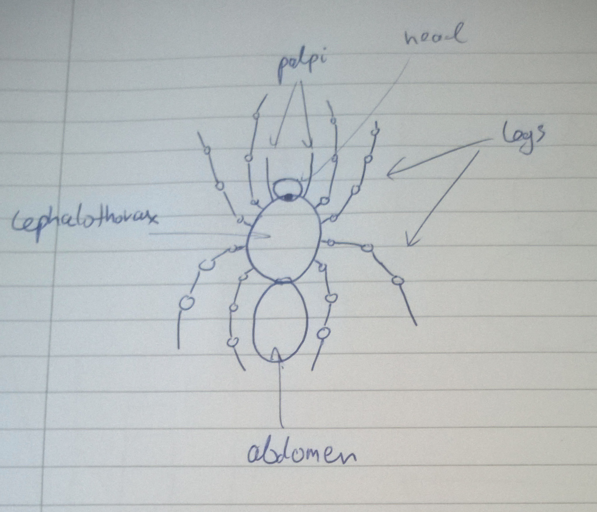

# Kamil Orłowski
# C11743571

# Interim assignment
Changes have been made to:
Assignment class - a new sub-class of Game which builds five pyramids using the Box class
Box class - added a new constructor that takes a vec3 as a parameter

# Plans for the main assignment
My plan is to animate a spider. The spider has eight legs, each joined with the cephalothorax. Other parts of body connected with cephalothorax are the head, the abdomen and palpi.

A walking spider uses eight legs to move. Those legs have several joints each and they move in coordination. The second pair of legs counters the first pair. The third pair follows the first, and the fourth mirrors the movement of the second pair.

